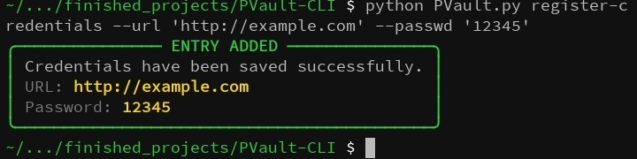
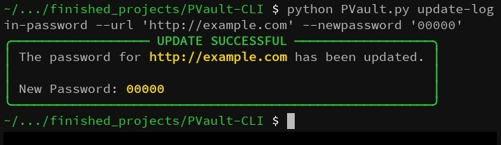
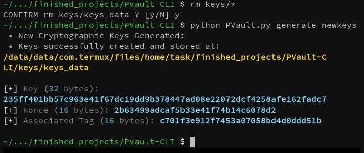
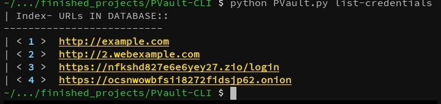
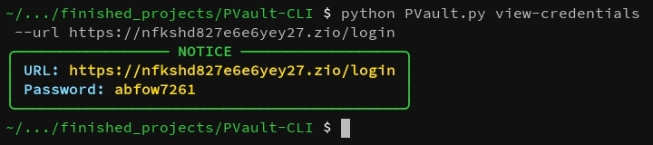

# 🔐 PVault CLI

> “A lightweight command-line password manager”


-grey.svg)

---

## 🧭 Overview

**PVault CLI** 
A lightweight command-line password manager built with Python.
securely store, update and retrieve passwords for your URLs/Login details in a local database and keeps them encrypted using AES-GCM. Everything runs locally (no cloud stuff).

CAUTION: THIS IS A VERY MODERN & STRONG ENCRYPTION LOCK. BRUTE FORCING IF LOCKED OUT IS USELESS HERE. LOSS THE KEY FILE, LOSS DATA..
---

- Update existing passwords
- Generate strong random passwords
- List all stored URLs
- View stored passwords for a specific URL

## 📦 Features
- Register new credentials (URL link + password)
- AES-GCM encryption via `cryptography`
- Update specific existing passwords
- Local SQLite database for credentials
- Colored, user-friendly CLI using `rich` + `typer`
- Key generation and management
- CRUD operations for stored passwords
---

## Installation

0. Clone the repository:

```bash
git clone https://github.com/u112000/PVault
cd PVault

pip install typer rich
```
---

```
| Command               | Description                        |
| --------------------- | ---------------------------------- |
| generate-newkeys      | Generate a new encryption key file |
| register-credentials  | Add new credentials to the vault   |
| update-login-password | Update an existing password        |
| list-credentials      | List all stored URLs               |
| view-credentials      | View the password for a given URL  |
| --help                | Help menu display

```
1. Register Credentials

Add a new URL and password to the database.
```
python PVault.py register-credentials --url github.com --passwd mysecret123

--url: URL to register

--passwd: Password for that URL
```
Image Reference:



2. Update Password

Update the password for an existing URL.
```
python3 PVault.py update-login-password --url "example.com" --newpassword "NewPass456"

--url: URL to update

--newpassword: New password
```
Image Reference:



3. Generate Database new keys

Generate AESGCM values.
```
python PVault.py generate-newkeys
```
Image Reference:



4. List Credentials

View all URLs currently saved in the database.
```
python PVault.py list-credentials
```
Image Reference:



5. View Credentials

Retrieve the password for a specific URL.
```
python PVault.py view-credentials --url github.com

--url: URL to retrieve
```
Image Reference:



## 🔑 Key Notes
```
Keys are stored under the keys/ directory.

The key file can be carried around with you. as long as you can provide that same file when interacting with the program otherwise all previous data is unaccessible.
LOSING or DELETING the key file will make encrypted data unrecoverable.

Do not overwrite key file unless you intend to reset the vault.
if the key/* are accidentally lost🤷. Then delete the SQL file(as it contents are now unless and unreadable as modern encryption is concerned)  and relaunch the program with "PVault.py Generate-Newkeys"
```
---


## ⚠️ Disclaimer

- This project is for personal use and learning.
- It is not intended for production-grade password storage.


## Roadmap
- AESGCM encryption features ✓ done
- Web front integration


## Authors

- [@112000](https://github.com/u112000)
